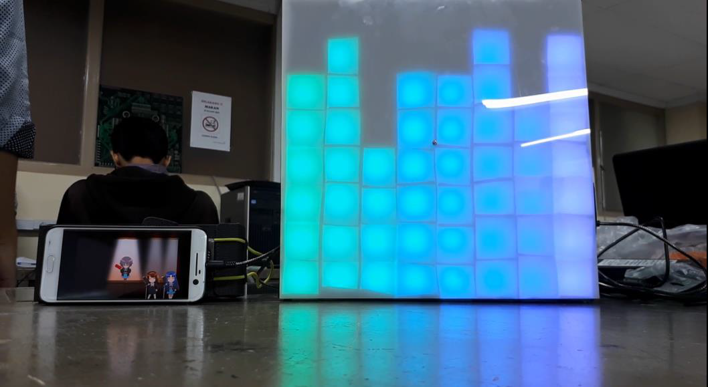
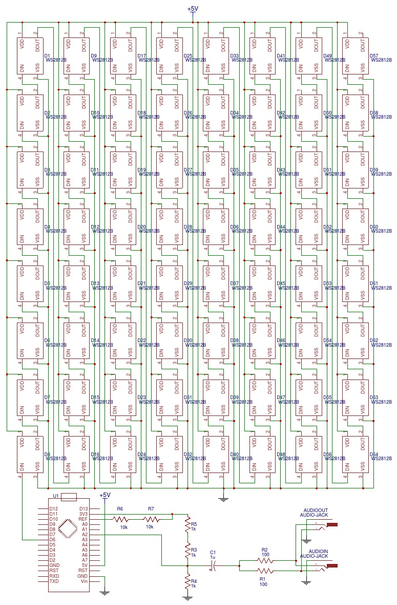

# Spectrum Analyzing Pop Art

The spectrum analyzer basically analyzes the intensity of different frequencies in an audio signal. I created this project for a class in University that involves using microcontrollers and analog signals. This piece of hardware can recieve an audio signal from any audio source through a stereo audio jack, visualizes the aformentioned audio signals, and also has a pass-through so you can connect to an audio output device such as a speaker or headphones.

---

## Hardware

### Parts List

* Arduino Nano
* WS2812B LEDs
* 3.5mm Audio Jack
* 5V Adaptor/Power supply (Ideally 5A)
* Resistors
* Capacitors

To make this spectrum analyzer, we need to first Build an RGB LED-Matrix. In our case, we made an 8x8 matrix as shown above. Notice that the data lines of the control inputs are connected one after the other. This will make it easier for us to control the LED matrix through the arduino code. The entire matrix will be controlled using PWM (Pulse-Width Modulation) through the Arduino Nano's D6 Pin that supports the 16-bit Timer required to generate the data necessary to control the LEDs.

The audio jack in and audio jack out that you can see on the schematic are connected dirrectly to each other. This is what allows the pass-through functionality. Resistor R1 and R2 are used to combine the left and right audio signals so that we can convert the stereo audio into mono audio that the spectrum analyzer can interpret. Only one capacitor is needed for this project as it is only used as a decoupling capacitor so that the audio signal that is outputted won't be offsetted by DC voltage.

The main part of this schematic is the DC offset circuit. This is vital because the ADC (Analog to Digital Converter) of the Arduino cannot tolerate negative voltages less that -0.5 V, and since audio signals have an amplitude of around 1 to 2 Volts, this circuit offsets the audio signal by 1.1 V so that the audio signals can be read by the Arduino safely.

---

## Code

### Required Libraries

* FFT Library : http://wiki.openmusiclabs.com/wiki/ArduinoFFT
* LED FastLED : https://github.com/FastLED/FastLED/wiki/Basic-usage

Make sure you install both of these libraries. I also have commented the source code so you can learn more about how the main code works and get an idea on how you can make one for yourself.